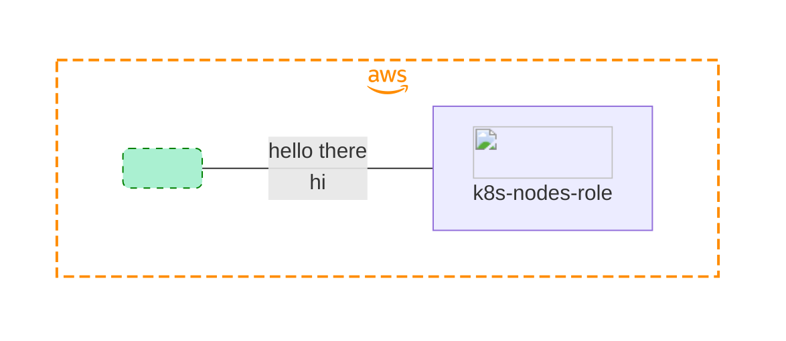

# Kubernetes Cluster with Terraform and AWS

This repository contains Terraform configuration files to create a Kubernetes cluster on AWS. The cluster is provisioned using Terraform, and it leverages AWS services for infrastructure management.

## Infra-prin Container

The `infra-prin` container is used in this repository to provide the necessary tools for managing the Kubernetes cluster. It comes pre-installed with `kubectl`, AWS CLI, and other utilities needed to interact with the cluster.

## AWS Authentication

Please note that AWS authentication is performed outside of the `infra-prin` container. You will need to authenticate with AWS using your preferred method, such as configuring AWS CLI with your access key and secret key.

Once authenticated, the `~/.aws` directory is mounted inside the `infra-prin` container to provide the necessary credentials and tokens for accessing AWS services.

## Getting Started

To get started with creating the Kubernetes cluster:

1. Get authenticated with AWS using your preferal method locally.
2. Run `make run` to build and get inside of the `infra-prin` container.
3. cd inside the k8s TF folder `cd ./terraform/kubernetes-cluster.
4. Plan and apply your changes `terraform plan`.
